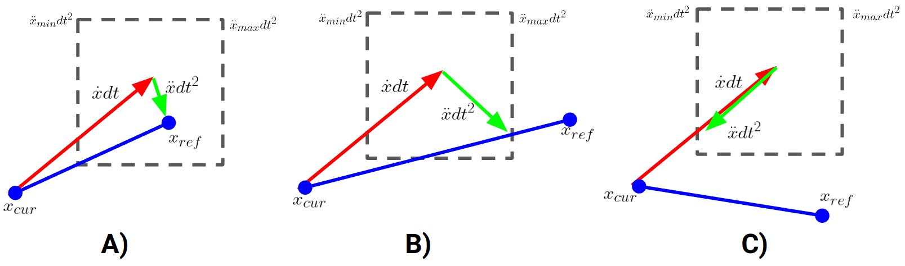

### AccelerationLimitedPlugin
Applies smoothing by limiting the acceleration between consecutive commands.
The purpose of the plugin is to prevent the robot's acceleration limits from being violated by instantaneous changes
to the servo command topics.

There are three cases considered for acceleration-limiting illustrated in the following figures:

In the figures, the red arrows show the displacement that will occur given the current velocity. The blue line shows the displacement between the current position and the desired position. The black dashed line shows the maximum possible displacements that are within the acceleration limits. The green line shows the acceleration commands that will be used by this acceleration-limiting plugin.

- Figure A: The desired position is within the acceleration limits. The next commanded point will be exactly the desired point.
- Figure B: The line between the current position and the desired position intersects the acceleration limits, but the reference position is not within the bounds. The next commanded point will be the point on the displacement line that is closest to the reference.
- Figure C: Neither the displacement line intersects the acceleration limits nor does the reference point lie within the limits. In this case, the next commanded point will be the one that minimizes the robot's velocity while maintaining its direction.
