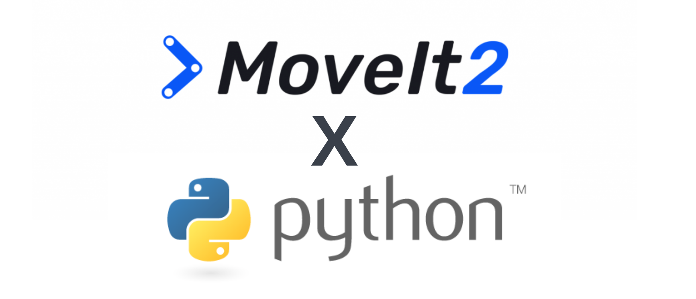

# MoveIt 2 Python Library

`moveit` is a Python library for interfacing with the core functionalities of MoveIt 2.
The goal of this library is to provide a simplified interface for MoveIt 2 Python users.

This Python library depends on [pybind11](https://pybind11.readthedocs.io/en/stable/index.html) for generating Python bindings.
The project is split into the following folders:

    ├── docs                 # Sphinx documentation files
    ├── moveit               # Python library stubs; Python functionalities built on top of bindings
    ├── src/moveit           # pybind11 binding code
    ├── test                 # Unit and integration testing

## Tutorials
We are continuing to add tutorials for the MoveIt 2 Python library. Of particular note is the fact that one can interact with MoveIt interactively since Python is an interpreted language, our tutorials demonstrate this through leveraging Jupyter notebooks. For further details please consult the [MoveIt 2 tutorials site](https://moveit.picknik.ai/main/index.html).

## Contribution Guidelines
Community contributions are welcome.

For detailed contribution guidelines please consult the official [MoveIt contribution guidelines](https://moveit.ros.org/documentation/contributing/).

## Acknowledgements
Thank you to the [Google Summer of Code program](https://summerofcode.withgoogle.com/) for sponsoring the development of this Python library. Thank you to the MoveIt maintainers Henning Kayser (@henningkayser) and Michael Gorner (@v4hn) for their guidance as supervisors of my GSoC project. Finally thank you to the [ML Collective](https://mlcollective.org/) for providing compute support for this project.
