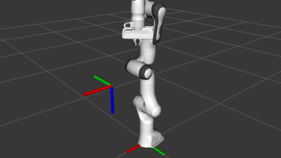

# Running the Demos
1) [Installation](#Installation)
2) [C++ Interface Demo](#Cpp-Interface-Demo)
3) [Component Demo](#Component-Demo)
4) [Teleoperation Demo](#Teleoperation-Demo)


## Installation
`moveit_servo` is currently stable on ROS Foxy.

`moveit_servo` can be installed from source as part of `moveit`, roughly following [these instructions](https://moveit.ros.org/install-moveit2/source/).

#### Create a workspace
```bash
export COLCON_WS=~/ws_ros2/
mkdir -p $COLCON_WS/src
cd $COLCON_WS/src
```

#### Download source code
```bash
git clone https://github.com/ros-planning/moveit2.git -b main
vcs import < moveit2/moveit2.repos
rosdep install -r --from-paths . --ignore-src --rosdistro foxy -y
```

#### Build
```bash
cd $COLCON_WS
colcon build --event-handlers desktop_notification- status- --cmake-args -DCMAKE_BUILD_TYPE=Release
```

## Cpp Interface Demo
The simplest demo is the C++ interface demo. In it, a simulated Panda arm is spawned and shown in Rviz, along with a collision object. 

First, a simple joint command is sent to the arm for a few seconds.

Then, a simple, repeating Cartesian command is sent indefinitely. Eventually the arm will slow and stop as it approaches the collision object (although commands are still being published).

#### To run
```bash
source $COLCON_WS/install/setup.bash
ros2 launch moveit_servo servo_cpp_interface_demo.launch.py
```

#### Expected Output


## Component Demo
`moveit_servo` is also offered as a composable node that may be run in a container with other components. 

This demo starts a `moveit_servo` instance in a container with the `tf` publisher. Commands may be sent to the arm by publishing to the `moveit_servo` input topics, and the `moveit_servo` behavior may be controlled by its offered services.

#### To run
```bash
source $COLCON_WS/install/setup.bash
ros2 launch moveit_servo servo_server_demo.launch.py
```

To start the `moveit_servo` and publish a steady command, open a new terminal and run:
```bash
source $COLCON_WS/install/setup.bash
ros2 run moveit_servo fake_command_publisher
```

#### Expected ouput


## Teleoperation Demo
`moveit_servo` is a versatile tool for teleoperating a manipulator. Inputs can include generic `TwistStamped` or `JointJog` commands, collisions can be detected and avoided, and singular positions can be avoided. 

The teleoperation demo spawns a Panda arm and shows it in Rviz with a few simulated tables. Then it uses `moveit_servo` to control the arm following user inputs with a game controller. 

This demo was written for an Xbox 1 controller, but can easily be modified for any generic gamepad that works with the [Joy package](https://index.ros.org/p/joy/#foxy). 

#### To run
Make sure your controller is plugged in and can be detected by `ros2 run joy joy_node`. Usually this happens automatically after plugging the controller in.

Open a terminal and run
```bash
source $COLCON_WS/install/setup.bash
ros2 launch moveit_servo servo_teleop.launch.py
```
You should now be able to input commands via the controller. Default supported actions include Cartesian and joint commands, and switching the frame of the Cartesian commands.

#### Expected output


Please note the controller overlay is for demonstration purposes and is not part of the actual demonstration.
