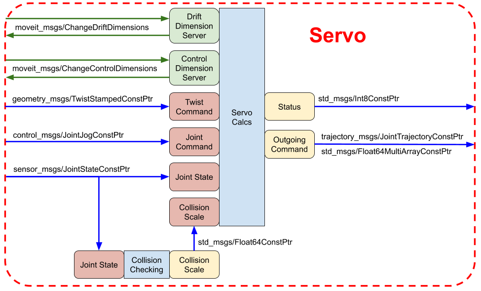

# Manipulator Servo Tutorial
This tutorial describes `moveit_servo` and aims to get you sending velocity-streaming commands to your robot quickly and painlessly.

# Servo Overview
`moveit_servo` is an [inverse Jacobian](http://www.andreasaristidou.com/publications/papers/IK_survey.pdf) solver that accepts 6 DoF twist velocity commands and converts them to joint commands. The SVD pseudo-inverse of the Jacobian is used to allow non-square Jacobian matrices as in the case where the number of joints is not 6.

Using `moveit_servo` allows you to stream End Effector (EEF) velocity commands to your manipulator and have it execute them concurrently. This enables teleoperation via a wide range of input schemes, or for other autonomous software to control the robot - in visual servoing or closed loop position control for instance.

### Features
The primary use of `moveit_servo` is to perform Cartesian EEF commands, but because a lot of joint validation and safety mechanisms are done behind the scenes, `moveit_servo` is also a good option for sending joint commands to your robot.

Core features of `moveit_servo` include:
1) **Cartesian EEF commands** can be sent in any valid frame. If `Servo` can find a transformation to the frame, then it will perform the command in that frame. You can servo in the manipulator planning frame, the tool point center frame, or a specific task's frame.
2) **Joint commands** are accepted and go through the same safety checking and limit enforcement as Cartesian commands. This is perfect when you don't want to directly control the EEF, but still want to send commands. Examples include: rotating just the last joint to twist the EEF, turning just the first joint to rotate the whole manipulator to a new area, or tweaking the position of a few joints to get the manipulator into a better stow position.
3) **Collision checking** is performed during motion. If the manipulator is getting close to an external collision with an object or an internal collision with itself, the motion will slow and stop, avoiding any collision.
4) **Joint position, velocity, and acceleration limits** (as defined in the URDF) are enforced for all movements.
5) **Singularity checking** is performed for Cartesian commands. As the manipulator is commanded toward a singular position, the motion slows to avoid it. This eliminates large, unwanted, or oscillatory movements.
6) **Inputs are generic messages** so that any other piece of software that can output a `TwistStamped` or `JointJog` message can control `Servo`. This enables a huge number of teleoperation input devices, and interfacing with other software.

### Inputs/Outputs
Inputs to `moveit_servo` include
| Input      | Type | Description     |
| :---:        |    :----:   |          :---: |
| Cartesian EEF command  | TwistStamped ROS message | When sent, `Servo` will attempt to move the EEF following the given twist velocity. |
| Joint command   | JointJog ROS message | When sent, `Servo` will move the joints following the given command |
| Joint states   | JointState ROS message | Typically from `/joint_states`, the current robot position |
| Control dimensions   | boolean array | Controls which twist directions commands can be accepted in. Non-controlled directions are set to 0 input. Useful for rejecting input noise (e.g. with 6 DoF mouse) |
| Drift dimensions   | boolean array | Sets the twist directions that will be ignored in the math. This may result in some motion in the set directions, but can be useful for reducing the task space and avoiding singularities |

`Servo` outputs include:
| Output      | Type | Description     |
| :---:        |    :----:   |          :---: |
| Joint output command  | JointTrajectory OR Float64MultiArray ROS message | Contains the commands to be sent to the manipulator controller |
| Status   | Int8 ROS message | Encodes the current status of `moveit_servo`. Examples: NO_WARNING, DECELERATE_FOR_COLLISION |


### Interface Options
In ROS2, `moveit_servo` offers 2 interfacing options: a direct C++ API, and as a standalone node component that receives commands via ROS interfaces.

#### C++ API
The C++ API is offered as the `Servo` class, defined in `include/moveit_servo/servo.h`. You can add a `Servo` instance to your existing project by:

1) Including `moveit_servo` in your CMakeLists
2) Including `moveit_servo/servo.h` in your file
3) Creating a `planning_scene_monitor` (if you don't already have one) and `ServoParameters` and passing both to a new `Servo` object.
4) Calling `start()` on the `Servo` instance and publishing commands.

See the [C++ interface demo](../src/cpp_interface_demo/servo_cpp_interface_demo.cpp) as an example, and the [Setting Up a New Robot](#Setting-Up-a-New-Robot) section later for details on getting your specific robot up and running.

The C++ API can be visualized with:


#### Composable Node Interface
A standalone component is also offered as a `ServoServer`. This allows you include starting a `ServoServer` in your launch file, and interact with `Servo` only through ROS topics and services. See the [servo server demo](../launch/servo_server_demo.launch.py) as an example.

The composable node interface can be visualized with:


# Setting Up a New Robot

### Preliminaries
The bare minimum requirements for running `moveit_servo` on your robot include:

1) A URDF for your robot
2) A SRDF for your robot
3) A controller that can accept joint positions or velocities from a ROS topic
4) Joint encoders that provide rapid and accurate joint position feedback.

Because the kinematics are handled by the core parts of `moveit`, it is recommended that you have a valid `moveit_config` package for your robot and you can run the demo launch file included with it.

#### A note on controllers
A simulated controller, [fake_components](https://github.com/ros-controls/ros2_control/tree/master/hardware_interface/src/fake_components) is used in the `moveit_servo` examples, and should at least be able to get `moveit_servo` working with a simulated version of your robot. Please see [the example config file](panda.ros2_control.xacro) and [launch file](../launch/servo_cpp_interface_demo.launch.py#L73-L78) for an example of how to set that up for your robot.

### Installation
Please see the [Running the Demos](running_the_demos.md) guide for installation instructions. Running at least the C++ Interface Demo will make sure `moveit_servo` is properly installed.

### Input devices
The two primary inputs to `moveit_servo` are Cartesian commands and joint commands. These come into `moveit_servo` as [TwistStamped](http://docs.ros.org/melodic/api/geometry_msgs/html/msg/TwistStamped.html) and [JointJog](http://docs.ros.org/api/control_msgs/html/msg/JointJog.html) messages respectively. The source of the commands can be almost anything including: gamepads, voice commands, a SpaceNav mouse, or PID nodes (e.g. for visual servoing).

The incoming messages do need a few things to be able to work with `moveit_servo`:

1) **TwistStamped** and **JointJog** *need* a timestamp in the header that is updated when the message is published. This timestamp is used to track when `Servo` should stop listening to "stale" commands
2) **TwistStamped** messages *can* proivde a `frame_id` in the header. If this frame name is valid and can be transformed to, Servo will perform Cartesian servoing in the given frame. Empty frames default to the frame given in the configuration file
3) **JointJog** messages *need* to have valid joint names in the `joint_names` field that correspond with the commands you are trying to give in the `displacements` or `velocities` fields. Note that each of the 3 fields should be equal in length and in the same order.

### Servo config
In `config/panda_simulated_config.yaml` you can see a list of all the parameters that control `moveit_servo`'s behavior. When setting up your robot, it is recommended to copy this file into your package (so it is tracked with your version control) and modifying it from the defaults. The example file shows the configuration for all of the demonstrations. These values are generally good, but a few will need to be changed based on the specific robot. The ones that you certainly need to update are discussed below:

1) `robot_link_command_frame`: Update this to be a valid frame in your robot. Recommend the planning frame or EEF frame
2) `command_in_type`: Set to "unitless" if your input comes from a joystick, "speed_units" if the input will be in meters/second or radians/second.
3) `command_out_topic`: Change this to be the input topic of your controller
4) `command_out_type`: Change this based on the type of message your controller needs
5) `publish_joint_positions`, `publish_joint_velocities`: Change these based on what your controller needs. Note if `command_out_type` = `std_msgs/Float64MultiArray`, only one of these can be True
6) `joint_topic`: Change this to be the joint_state topic for your arm
7) `move_group_name`: Change this to be the name of your move group, as defined in your SRDF
8) `planning_frame`: This should be the planning frame of your group

The other parameters in the file give you fine control over the performance of `Servo`, but to start out the example values given should be ok.

### Supporting Nodes
You will need to launch either a `ServoServer` or the node containing your `Servo` C++ instance. In addition, `moveit_servo` needs a few other nodes to be running to work:

1) Something publishing tf transformation data, typically a [robot_state_publisher](https://index.ros.org/r/robot_state_publisher/#foxy)
2) Your controller that listens to the topic set in the `command_out_topic` and moves the robot accordingly
3) *Optionally* Rviz to visualize the robot

See any of the demonstration launch files for examples.

# Using Servo
The below sections give details on how to actually interact with `moveit_servo` once it is running.

### Loading Parameters

##### Servo Server Component
If using the composable node, you will need to load the parameters into the "moveit_servo" namespace:

```python
servo_params = { 'moveit_servo' : servo_yaml }
container = ComposableNodeContainer(
            name='moveit_servo_demo_container',
            namespace='/',
            package='rclcpp_components',
            executable='component_container',
            composable_node_descriptions=[
              ComposableNode(
                    package='moveit_servo',
                    plugin='moveit_servo::ServoServer',
                    name='servo_server',
                    parameters=[servo_params, robot_description, robot_description_semantic],
                    extra_arguments=[{'use_intra_process_comms' : True}])
            ],
            output='screen',
    )
```

Notice the lines:
```python
servo_params = { 'moveit_servo' : servo_yaml }
```
and
```python
parameters=[servo_params, robot_description,
```

where the read YAML file is put into a dictionary named `moveit_servo` and passed to the node.

##### C++ API
The C++ API allows you to put the parameters in whatever namespace you want, and gives you greater control over the reading of the parameters.

The parameters should be passed into the node as usual, then in your source code you can read them with:
```cpp
#include <moveit_servo/servo_parameters.h>
#include <moveit_servo/servo.h>

static const rclcpp::Logger LOGGER = rclcpp::get_logger("logger_name");
auto node = std::make_shared<rclcpp::Node>("servo_demo_node");

auto servo_parameters = moveit_servo::ServoParameters::makeServoParameters(node, LOGGER);
if(servo_parameters.get() == nullptr)
{
  RCLCPP_FATAL(LOGGER, "Could not get parameters");
  return -1;
}
```

When creating and starting the Servo instance, you need to pass the read parameters as
```cpp
moveit_servo::Servo servo(node, servo_parameters, planning_scene_monitor);
while (!servo.waitForInitialized() && rclcpp::ok())
{
  rclcpp::Clock& clock = *node->get_clock();
  RCLCPP_WARN_STREAM_THROTTLE(LOGGER, clock, 5000,
                              "Waiting for ServoCalcs to recieve joint states");
}
servo.start();
```

### Publishing Commands
Sending commands to `moveit_servo` is the same regardless of if you are using the composable node or C++ API. You need to create a message, populate the fields, and publish it to the correct topic.

An example of publishing a Cartesian EEF command is:
```cpp
auto twist_pub = node->create_publisher<geometry_msgs::msg::TwistStamped>(servo_parameters->cartesian_command_in_topic, 10);

auto msg = std::make_unique<geometry_msgs::msg::TwistStamped>();
msg->header.stamp = node->now();
msg->header.frame_id = "panda_link0";
msg->twist.linear.x = 0.3;
msg->twist.angular.z = 0.5;

twist_pub->publish(std::move(msg));
```

An example of publishing a joint command is:
```cpp
auto joint_pub = node->create_publisher<control_msgs::msg::JointJog>(servo_parameters->joint_command_in_topic, 10);

auto msg = std::make_unique<control_msgs::msg::JointJog>();
msg->header.stamp = node->now();
msg->joint_names.push_back("panda_joint1");
msg->velocities.push_back(0.3);

joint_pub->publish(std::move(msg));
```

Notice that the topic to publish to is the Servo parameters `cartesian_command_in_topic` and `joint_command_in_topic`.
